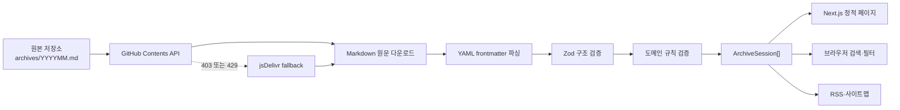
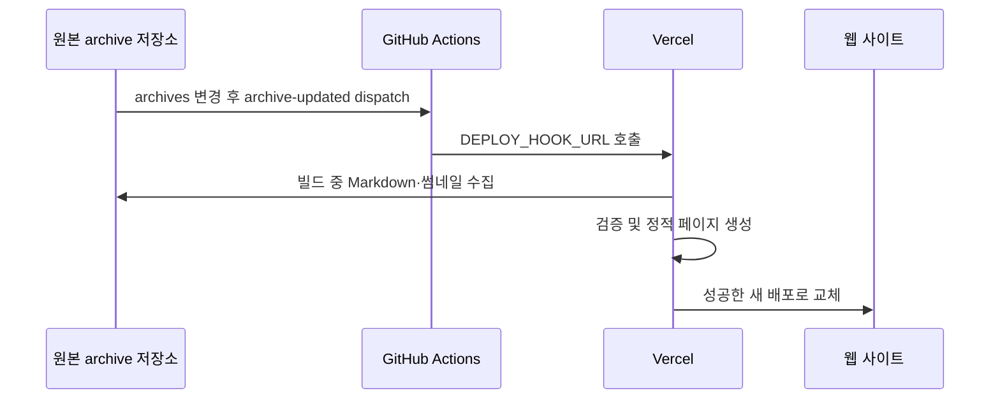

# Frontend Archive 스터디 발표 가이드

## 1. 프로젝트를 한 문장으로 설명하기

Frontend Archive는 GitHub의 Markdown을 콘텐츠 원본으로 사용하고, 빌드 시 데이터를 수집·검증해 정적 페이지로 배포하는 공개형 프론트엔드 스터디 아카이브다.

이 프로젝트를 설명할 때는 단순히 "스터디 글 목록"이라고 소개하기보다 다음 세 가지를 함께 말하는 것이 좋다.

- GitHub 저장소가 CMS이자 단일 원본이다.
- 외부 데이터는 빌드 시 검증하며, 잘못된 원본은 배포하지 않는다.
- 사용자 검색은 서버가 아니라 브라우저에서 수행한다.

## 2. 전체 데이터 흐름



중요한 점은 방문자의 요청마다 GitHub를 조회하지 않는다는 것이다. `next build` 과정에서 원본을 읽어 페이지를 생성하므로 사용자는 마지막으로 성공한 배포의 데이터 스냅샷을 본다.

## 3. 핵심 데이터 수집

### 3.1 데이터 출처

유일한 콘텐츠 원본은 `Frontend-Archive/archive` 저장소의 `archives/YYYYMM.md`다. 웹 프로젝트에는 회차 데이터를 복사해서 보관하지 않으며 별도 DB도 없다.

GitHub 저장소를 원본으로 선택한 이유는 다음과 같다.

- 기존 작성·리뷰·변경 이력을 그대로 활용할 수 있다.
- 공개 읽기 전용 MVP이므로 인증과 관리자 화면이 필요하지 않다.
- DB와 Markdown 사이의 동기화 문제를 만들지 않는다.

### 3.2 수집 순서

`lib/archive.ts`의 `getArchiveSessions()`가 콘텐츠 접근의 단일 진입점이다.

1. GitHub Contents API로 `archives` 디렉터리를 조회한다.
2. 이름이 `YYYYMM.md` 형식인 파일만 선택한다.
3. 각 파일의 `download_url`에서 원문을 병렬로 내려받는다.
4. Markdown 상단의 YAML frontmatter를 추출한다.
5. 구조와 도메인 규칙을 검증한다.
6. 화면에서 사용할 `ArchiveSession[]`로 정규화한다.
7. 회차를 날짜 기준 최신순으로 정렬한다.

`ARCHIVE_GITHUB_TOKEN`은 선택 사항이다. 토큰이 있으면 GitHub 요청에 Bearer 인증을 추가해 비인증 요청보다 높은 API 한도를 사용할 수 있다.

### 3.3 fallback

GitHub 목록 API가 `403` 또는 `429`를 반환하면 jsDelivr의 패키지 파일 목록으로 전환한다. 그 밖의 상태 코드는 권한·주소·서버 문제를 숨기지 않기 위해 즉시 오류로 처리한다.

fallback도 동일한 공개 GitHub 저장소의 `main` 브랜치를 읽는다. 따라서 데이터 원본이 둘로 늘어나는 것이 아니라 전달 경로만 바뀐다.

## 4. 원본 데이터 계약과 검증

예상하는 frontmatter의 개념적 형태는 다음과 같다.

```yaml
---
id: 7
date: "2026-09-13"
title: "스터디 7회차"
type: "on-line"
articles:
  - author: "권시현"
    title: "게시글 제목"
    url: "https://example.com/article"
    tags: ["React", "성능 개선"]
  # 나머지 멤버 슬롯도 같은 순서로 존재
---
```

검증은 두 층으로 나뉜다.

### 4.1 Zod 구조 검증

- `id`는 양의 정수다.
- `date`는 `YYYY-MM-DD` 문자열이다.
- `type`은 `on-line` 또는 `off-line`이다.
- `articles`는 현재 멤버 수와 같은 네 개여야 한다.
- 알 수 없는 필드는 허용하지 않는다.

### 4.2 도메인 규칙 검증

- 실제로 존재하는 날짜여야 한다.
- 파일명 연·월과 `date`의 연·월이 일치해야 한다.
- `title`은 `스터디 {id}회차`여야 한다.
- 발표자는 정해진 네 명이 정해진 순서로 존재해야 한다.
- 회차 ID는 전체 파일에서 중복될 수 없다.
- 게시 글 URL은 HTTP 또는 HTTPS여야 한다.
- `title`, `url`, `tags`는 모두 채우거나 모두 비워야 한다.

세 필드가 모두 비어 있으면 삭제하거나 오류로 처리하지 않고 `pending` 상태로 변환한다. 일부만 작성된 경우에는 의도인지 실수인지 판단할 수 없으므로 빌드를 실패시킨다.

### 4.3 왜 빌드를 실패시키는가

핵심 데이터 오류를 화면에서 조용히 제외하면 운영자는 누락을 발견하기 어렵다. 이 프로젝트는 새 빌드를 실패시켜 기존 정상 배포를 유지하는 방식을 선택했다. 즉, 가용성보다 데이터 무결성을 포기한 것이 아니라 **오류가 있는 새 버전만 차단하고 마지막 정상 버전의 가용성을 유지**한다.

## 5. 썸네일 수집

썸네일은 핵심 데이터와 별도의 `scripts/fetch-thumbnails.mjs` 파이프라인에서 처리한다. `package.json`의 `prebuild`에 연결되어 있어 본 빌드보다 먼저 실행된다.

1. 원본 Markdown에서 게시글 URL을 수집하고 중복을 제거한다.
2. 각 원문 HTML에서 `og:image` 또는 `twitter:image`를 찾는다.
3. 상대 주소라면 게시글 주소를 기준으로 절대 주소로 바꾼다.
4. 응답의 `Content-Type`으로 실제 이미지 형식을 판단한다.
5. 최대 2MB인 지원 형식만 내려받는다.
6. 글 URL의 SHA-1 앞 16자리를 안정적인 파일명으로 사용한다.
7. `public/thumbnails`와 `lib/thumbnails.json`에 결과를 기록한다.

### 핵심 데이터와 다른 실패 정책

- Markdown 오류: 전체 빌드 실패
- 썸네일 오류: 경고만 남기고 빌드 계속
- 이미지가 없는 글: URL에서 만든 기하 도형 표시
- 이미지가 없었던 URL: 14일 동안 재확인 생략
- 네트워크 요청: 15초 후 중단

썸네일은 이해에 필수적인 정보가 아니므로 외부 블로그 장애가 전체 사이트 배포를 막지 않게 했다. 발표에서는 이를 "데이터 중요도에 따른 실패 격리"라고 설명할 수 있다.

## 6. 수집된 데이터의 가공

### 6.1 정렬과 멤버 집계

- 홈과 회차 탐색은 최신 회차부터 보여준다.
- 멤버 상세는 개인의 학습 흐름을 보여주기 위해 오래된 회차부터 보여준다.
- 게시된 글만 발표 수, 활동 기간, 최근 관심사 계산에 포함한다.
- 미작성 슬롯도 멤버의 전체 참여 회차에는 남겨 둔다.

### 6.2 주제 분류

원본 태그는 수정하지 않는다. 웹에서는 `lib/topics.ts`의 명시적인 표를 통해 태그를 여섯 개 상위 주제로 묶는다.

- 하나의 글이 여러 주제에 속할 수 있다.
- 알려지지 않은 태그가 하나라도 있으면 `기타` 주제에도 포함된다.
- 자동 분류나 AI 분류가 아니라 사람이 관리하는 결정적 규칙이다.

따라서 주제별 글 수의 합은 전체 글 수보다 클 수 있다.

## 7. 검색과 URL 상태

검색은 별도의 검색 서버나 API를 호출하지 않는다. 빌드 시 수집한 세션 데이터가 홈의 클라이언트 컴포넌트에 전달되고, 브라우저가 `lib/search.ts`의 순수 함수로 필터링한다.

- 조건: 검색어, 작성자, 태그, 주제
- 결합 방식: 모든 활성 조건을 만족해야 하는 AND
- 텍스트 검색 대상: 제목과 태그
- 정규화: 한국어 로케일 소문자화 후 모든 공백 제거
- 미작성 슬롯: 작성자만 선택했을 때는 표시하지만 검색어·태그·주제 조건에서는 제외

필터 상태는 React 상태에만 두지 않고 URL 쿼리에도 기록한다.

```text
/?q=react&author=민준경&topic=react-framework#archive
```

검색어 입력은 히스토리를 과도하게 쌓지 않도록 `replaceState`를 사용하고, 작성자·태그·주제 선택은 사용자가 뒤로 가기로 되돌릴 수 있도록 `pushState`를 사용한다.

## 8. 콘텐츠 갱신과 배포

현재 실행 설정의 기준 배포 경로는 표준 Next.js 빌드와 Vercel이다.



원본이 바뀌어도 재배포가 시작되지 않으면 사이트 데이터는 갱신되지 않는다. 운영 시에는 원본 저장소의 dispatch 설정, 웹 저장소의 `DEPLOY_HOOK_URL`, Vercel의 `NEXT_PUBLIC_SITE_URL`을 함께 확인해야 한다.

## 9. 주요 설계 선택과 트레이드오프

| 선택 | 얻는 것 | 감수하는 것 |
| --- | --- | --- |
| GitHub Markdown을 단일 원본으로 사용 | 리뷰·이력 재사용, DB 불필요 | 변경 반영에 재배포 필요 |
| 빌드 시 정적 생성 | 빠른 응답, SEO, 단순한 운영 | 빌드가 외부 API 상태에 영향받음 |
| 엄격한 원본 검증 | 누락과 잘못된 배포 방지 | 작은 원본 실수도 새 배포를 중단 |
| 클라이언트 검색 | 검색 API와 서버 상태 불필요 | 데이터가 커지면 초기 전송량 증가 |
| 수동 주제 매핑 | 예측 가능하고 테스트 가능 | 새 태그가 생길 때 코드 관리 필요 |
| 썸네일 실패 허용 | 외부 블로그 장애와 배포 분리 | 일부 글은 대체 도형으로 표시 |

## 10. 현재 한계와 확장 기준

- `YYYYMM.md` 파일명 계약상 한 달에 여러 회차를 표현하기 어렵다.
- 멤버 네 명과 순서가 코드에 고정돼 있다.
- 빌드마다 전체 Markdown을 다시 조회한다.
- 클라이언트가 전체 데이터를 받아 검색하므로 데이터가 커질수록 비효율적이다.
- 주제 매핑을 사람이 갱신해야 한다.
- GitHub와 jsDelivr가 모두 실패하면 새 빌드도 실패한다.
- 썸네일 HTML 추출은 정규식 기반이라 모든 사이트 구조를 지원하지 않는다.

현재처럼 수십 개 글을 다루는 읽기 전용 사이트에는 적절하다. 회차가 수백 개 이상이 되거나 검색 조건·권한·수정 기능이 필요해지면 증분 수집, 서버 검색, 영속 캐시 또는 DB 도입을 검토한다.

## 11. 예상 질문과 답변

### 왜 GitHub API를 사용했나요?

기존 Markdown 작성과 리뷰 흐름을 그대로 CMS로 활용하고 별도 관리자 화면과 DB 동기화를 만들지 않기 위해서다.

### 사용자가 접속할 때마다 GitHub API를 호출하나요?

아니다. 정적 빌드 과정에서 수집하고, 사용자는 마지막 성공 배포의 결과를 받는다.

### GitHub API 제한에 걸리면 어떻게 하나요?

선택적인 `ARCHIVE_GITHUB_TOKEN`으로 한도를 높일 수 있고, 목록 요청이 403 또는 429이면 jsDelivr로 전환한다.

### 원본 데이터 하나가 잘못되면 나머지만 보여주면 안 되나요?

조용한 누락은 발견하기 어렵다. 새 배포를 실패시키면 오류를 즉시 발견하면서 기존 정상 사이트는 계속 제공할 수 있다.

### 썸네일 하나가 실패해도 빌드가 실패하나요?

아니다. 핵심 콘텐츠가 아니므로 해당 글만 결정적인 대체 도형으로 표시한다.

### 검색 요청은 어디로 전송되나요?

외부로 전송되지 않는다. 이미 전달된 데이터에서 브라우저가 필터링하며 조건만 URL에 남는다.

### DB는 언제 필요해지나요?

관리자 편집, 사용자별 권한, 실시간 반영, 대규모 서버 검색, 여러 스터디 지원이 필요할 때 도입 근거가 생긴다.

## 12. 발표용 1분 설명

> 이 프로젝트는 GitHub Markdown을 단일 콘텐츠 원본으로 사용하는 정적 아카이브입니다. 빌드가 시작되면 GitHub Contents API로 월별 Markdown을 찾고, YAML frontmatter를 파싱한 뒤 Zod와 도메인 규칙으로 검증합니다. 잘못된 핵심 데이터는 새 배포를 중단하지만, 보조 정보인 썸네일 실패는 대체 이미지로 격리합니다. 검증된 데이터는 회차·멤버·주제 페이지와 RSS·사이트맵을 정적으로 만들고, 홈 검색은 전체 데이터를 받은 브라우저가 수행합니다. 이 구조는 현재 규모에서 DB와 검색 서버 없이 빠르고 관리하기 쉬운 사이트를 제공하는 대신, 콘텐츠 변경 때마다 재배포가 필요하다는 트레이드오프가 있습니다.

## 13. 코드 탐색 순서

발표 준비를 위해서는 다음 순서로 코드를 읽는 것이 가장 빠르다.

1. `lib/archive.ts` — 수집, 파싱, 검증, 정규화
2. `scripts/fetch-thumbnails.mjs` — 보조 이미지 수집과 실패 격리
3. `lib/topics.ts` — 태그를 상위 주제로 분류
4. `lib/members.ts` — 멤버별 학습 기록 집계
5. `lib/search.ts` — 브라우저 검색 규칙
6. `components/ArchiveExplorer.tsx` — URL과 UI 상태 동기화
7. `app/page.tsx` — 서버 데이터가 홈으로 전달되는 경계
8. `.github/workflows/redeploy.yml` — 원본 변경 후 재배포 진입점

## 14. 발표 전 확인할 문서 정합성

현재 `README.md`, `package.json`, `CLAUDE.md`는 표준 Next.js와 Vercel 배포를 기준으로 한다. 반면 `docs/05-implementation-journey.md` 일부에는 이전 `vinext`, Cloudflare Worker, OpenAI Sites 설명이 남아 있다. 발표 전에 구현 과정 문서를 현재 배포 구조에 맞춰 갱신하고 배포 전환 변경사항을 하나의 기준으로 커밋해야 한다.
